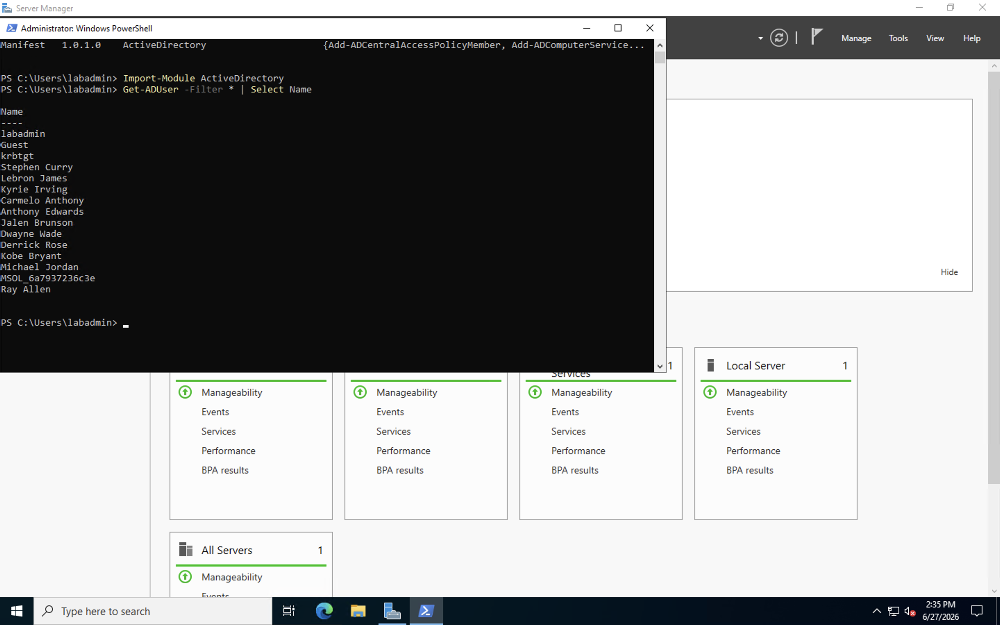
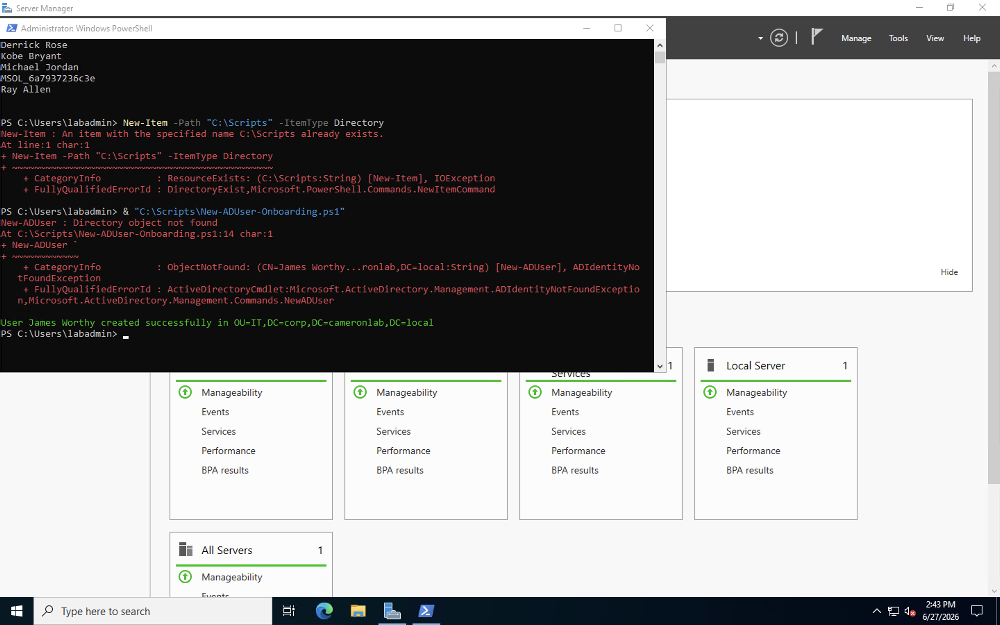
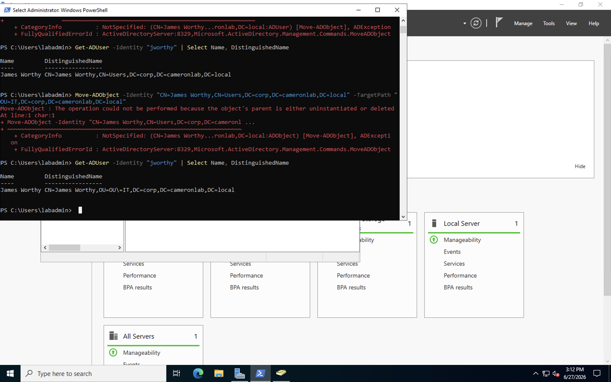
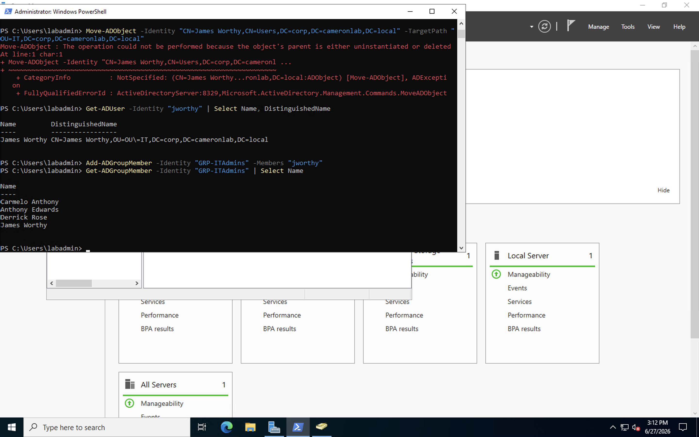
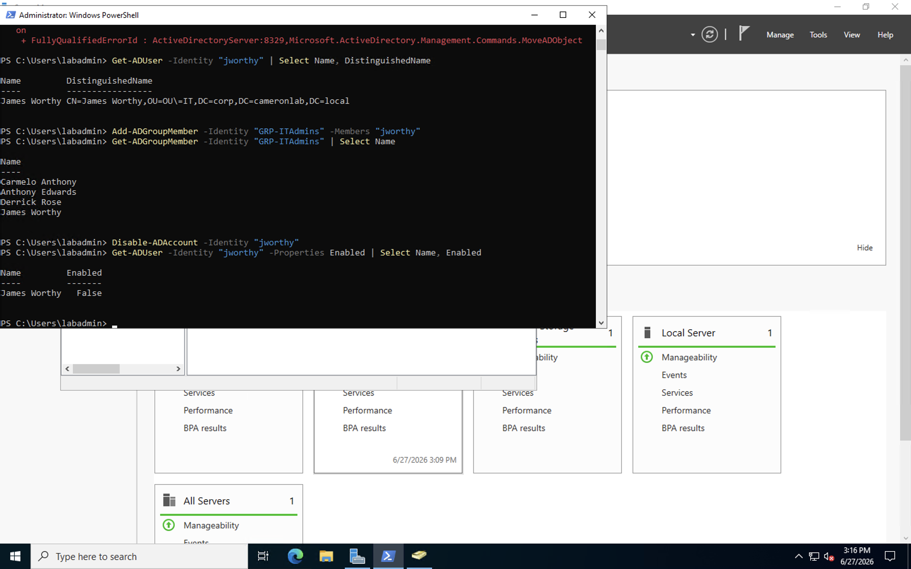
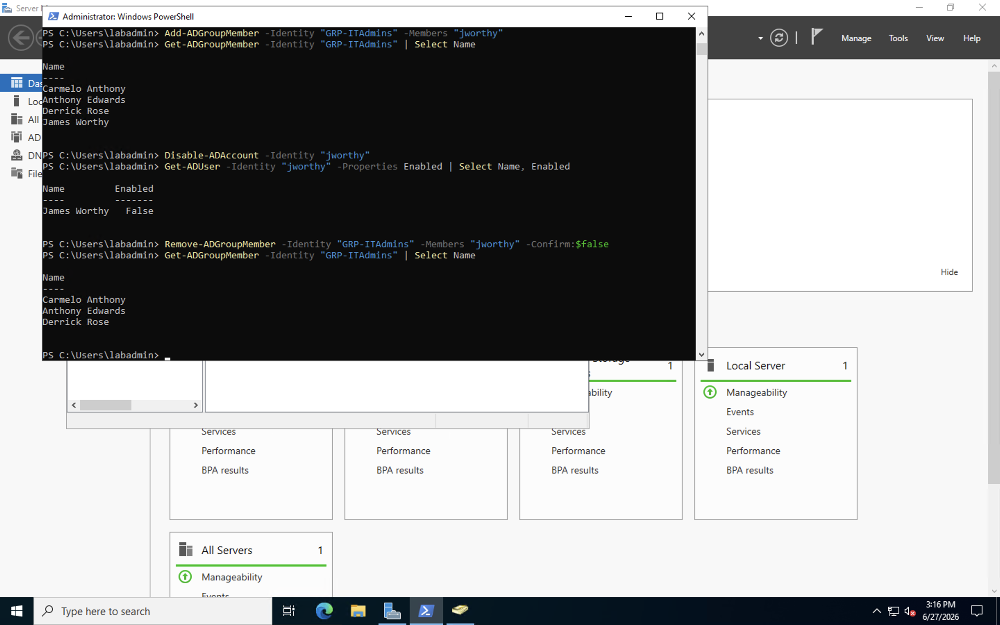
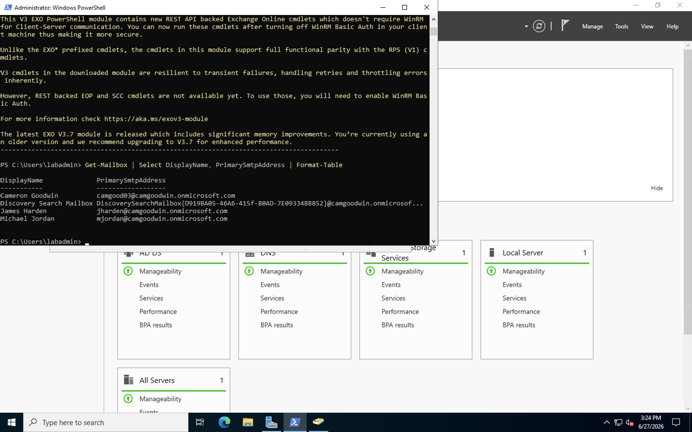
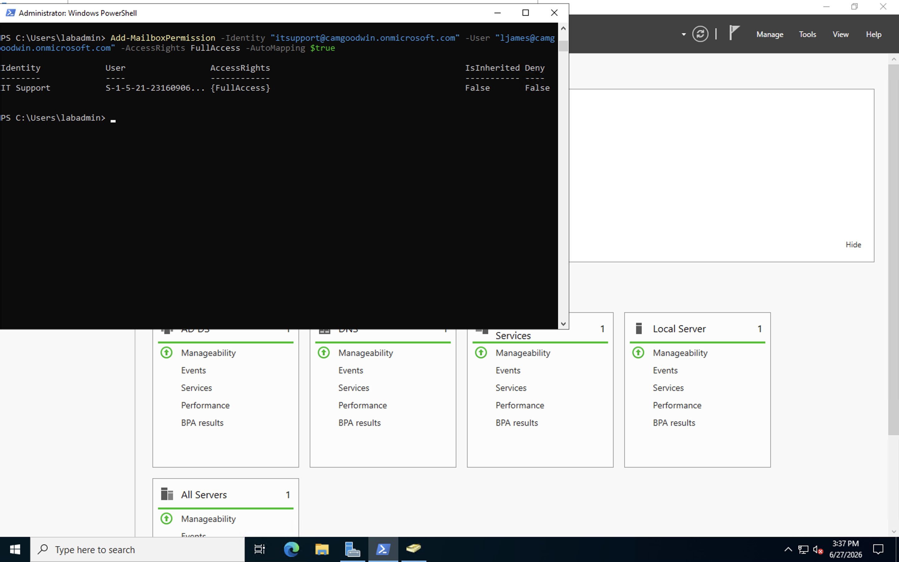
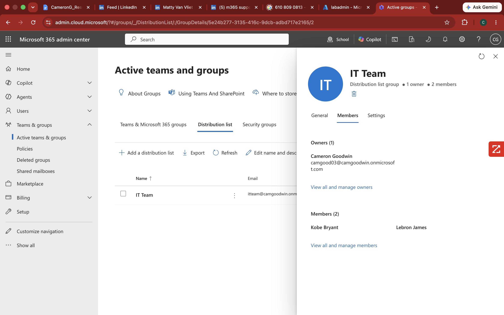
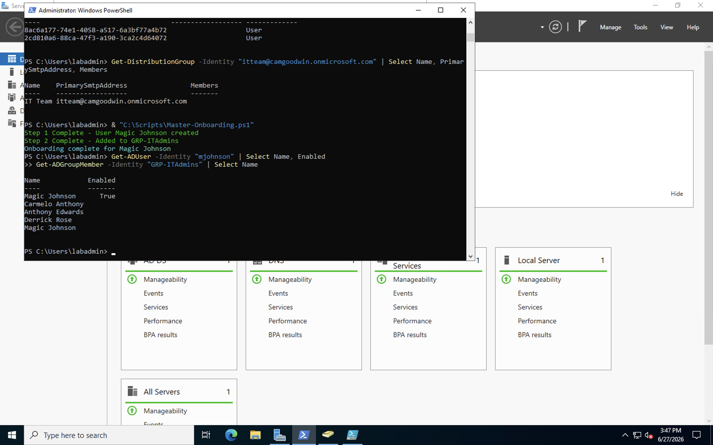

# PowerShell Automation & M365 Administration Lab

## Overview

This lab demonstrates enterprise-grade PowerShell automation for user lifecycle management and Microsoft 365 administration. The environment builds directly on top of the Hybrid Identity Lab — using the existing Azure VM, Active Directory domain, and Microsoft 365 E5 tenant to automate the same workflows IT administrators perform daily in enterprise organizations.

The lab covers the full employee lifecycle: automated user creation, security group assignment, shared mailbox provisioning, distribution group management, and account deprovisioning — all executed through PowerShell.

---

## Architecture

```
┌─────────────────────────────────────────────────────────────┐
│                    Windows Server 2022                       │
│                    corp.cameronlab.local                     │
│                                                             │
│  PowerShell Scripts (C:\Scripts)                            │
│  ├── Onboard-User.ps1                                       │
│  ├── Offboard-User.ps1                                      │
│  └── Master-Onboarding.ps1                                  │
│                         │                                   │
│              Active Directory                               │
│              OU=IT · OU=HR · OU=Finance                     │
└─────────────────────┬───────────────────────────────────────┘
                      │
                      │ Exchange Online Management Module
                      │
┌─────────────────────▼───────────────────────────────────────┐
│                Microsoft 365 E5                             │
│                camgoodwin.onmicrosoft.com                   │
│                                                             │
│  Shared Mailbox: itsupport@camgoodwin.onmicrosoft.com       │
│  Distribution Group: itteam@camgoodwin.onmicrosoft.com      │
└─────────────────────────────────────────────────────────────┘
```

---

## Technologies Used

| Technology | Purpose |
|---|---|
| PowerShell | Scripting and automation engine |
| Active Directory Module | AD user and group management via PowerShell |
| Exchange Online Management | M365 mailbox and distribution group management |
| Microsoft 365 E5 | Cloud productivity platform |
| Windows Server 2022 | On-premises domain controller hosting scripts |

---

## Lab Objectives

- Automate AD user creation, OU placement, and security group assignment using PowerShell
- Automate account deprovisioning including disable and group removal
- Connect PowerShell to Exchange Online for cloud mailbox management
- Create and manage shared mailboxes with delegated permissions
- Build and manage distribution groups via PowerShell
- Develop a master onboarding script that executes the full new hire workflow in a single command

---

## Environment Details

| Component | Value |
|---|---|
| Domain | corp.cameronlab.local |
| M365 Tenant | camgoodwin.onmicrosoft.com |
| Scripts Location | C:\Scripts |
| Test User Created | James Worthy (jworthy) |
| Master Script Test | Magic Johnson (mjohnson) |
| Shared Mailbox | itsupport@camgoodwin.onmicrosoft.com |
| Distribution Group | itteam@camgoodwin.onmicrosoft.com |

---

## Build Documentation

### Phase 1 — Environment Setup

**Set Execution Policy**

Before running any scripts execution policy must be set to allow local scripts to run:

```powershell
Set-ExecutionPolicy RemoteSigned -Force
```

**Import Active Directory Module and Verify Connection**

```powershell
Import-Module ActiveDirectory
Get-ADUser -Filter * | Select Name
```

This returned all existing NBA player user accounts confirming PowerShell is connected to the Active Directory environment.



---

### Phase 2 — User Creation

**Creating New AD User**

Used PowerShell to create a new test employee — James Worthy — to simulate a new hire onboarding workflow.

Commands run individually:

```powershell
$Password = ConvertTo-SecureString "Welcome@12345" -AsPlainText -Force

New-ADUser -Name "James Worthy" -GivenName "James" -Surname "Worthy" -SamAccountName "jworthy" -UserPrincipalName "jworthy@corp.cameronlab.local" -AccountPassword $Password -Enabled $true -ChangePasswordAtLogon $false
```



---

**Troubleshooting — Object Not Found Error**

During initial creation James Worthy was created in the default CN=Users container rather than the intended OU=IT. When subsequent commands referenced the jworthy object using OU-based path assumptions the commands returned "Directory object not found" errors.

Root cause: New-ADUser without a specified -Path parameter defaults to CN=Users. Subsequent Move-ADObject commands also failed due to path parsing issues with the domain name in PowerShell.

Resolution: Moved James Worthy to OU=IT manually via Active Directory Users and Computers. Right clicked user → Move → selected OU=IT. Verified correct placement via PowerShell:

```powershell
Get-ADUser -Identity "jworthy" | Select Name, DistinguishedName
```

Result confirmed: `CN=James Worthy,OU=IT,DC=corp,DC=cameronlab,DC=local`



**Key Learning:** When creating AD users via PowerShell always specify the -Path parameter explicitly to ensure correct OU placement. Omitting -Path causes users to land in CN=Users which requires a secondary move operation. In enterprise environments incorrect OU placement affects Group Policy application and access control inheritance.

---

### Phase 3 — Security Group Assignment

Added James Worthy to the GRP-ITAdmins security group:

```powershell
Add-ADGroupMember -Identity "GRP-ITAdmins" -Members "jworthy"
Get-ADGroupMember -Identity "GRP-ITAdmins" | Select Name
```



---

### Phase 4 — Account Deprovisioning

Simulated employee offboarding by disabling the account and removing group memberships:

```powershell
Disable-ADAccount -Identity "jworthy"
Get-ADUser -Identity "jworthy" -Properties Enabled | Select Name, Enabled
```

Result: Enabled = False confirmed

```powershell
Remove-ADGroupMember -Identity "GRP-ITAdmins" -Members "jworthy" -Confirm:$false
Get-ADGroupMember -Identity "GRP-ITAdmins" | Select Name
```





**Key Learning:** In enterprise offboarding disabling the account before removing group memberships is intentional. It immediately blocks authentication while preserving the audit trail of what groups the user belonged to. In regulated industries this sequence is required for compliance.

---

### Phase 5 — Connect PowerShell to Exchange Online

**Install Exchange Online Management Module:**

```powershell
Install-Module -Name ExchangeOnlineManagement -Force -AllowClobber
```

**Connect to Exchange Online:**

```powershell
Connect-ExchangeOnline -UserPrincipalName camgood03@camgoodwin.onmicrosoft.com
```

**Verify connection by listing mailboxes:**

```powershell
Get-Mailbox | Select DisplayName, PrimarySmtpAddress | Format-Table
```



---

### Phase 6 — Shared Mailbox Creation

Created an IT Support shared mailbox and delegated access to a team member:

```powershell
New-Mailbox -Shared -Name "IT Support" -DisplayName "IT Support" -Alias "itsupport" -PrimarySmtpAddress "itsupport@camgoodwin.onmicrosoft.com"

Add-MailboxPermission -Identity "itsupport@camgoodwin.onmicrosoft.com" -User "ljames@camgoodwin.onmicrosoft.com" -AccessRights FullAccess -AutoMapping $true
```

Result: Identity: IT Support · AccessRights: FullAccess · IsInherited: False · Deny: False



**Key Learning:** Shared mailboxes in enterprise environments are used for team inboxes like IT Support, HR, and Finance where multiple staff members need access without sharing credentials. AutoMapping:$true automatically adds the shared mailbox to the user's Outlook profile on next login — standard enterprise configuration.

---

### Phase 7 — Distribution Group Management

Created an IT Team distribution group and added members via PowerShell:

```powershell
New-DistributionGroup -Name "IT Team" -Alias "itteam" -PrimarySmtpAddress "itteam@camgoodwin.onmicrosoft.com" -MemberJoinRestriction Closed

Add-DistributionGroupMember -Identity "itteam@camgoodwin.onmicrosoft.com" -Member "ljames@camgoodwin.onmicrosoft.com"

Add-DistributionGroupMember -Identity "itteam@camgoodwin.onmicrosoft.com" -Member "kbryant@camgoodwin.onmicrosoft.com"
```

Note: Get-DistributionGroupMember returned GUIDs instead of display names due to hybrid identity sync timing. Verified membership through M365 Admin Center which confirmed both members correctly added.



---

### Phase 8 — Master Onboarding Script

Built a master onboarding script that executes the complete new hire workflow in a single command.

Saved as `Master-Onboarding.ps1` in C:\Scripts:

```powershell
# Master Onboarding Script
# Author: Cameron Goodwin
# Creates AD user, assigns security group, confirms onboarding complete

$FirstName = "Magic"
$LastName = "Johnson"
$Username = "mjohnson"
$Department = "IT"
$Password = ConvertTo-SecureString "Welcome@12345" -AsPlainText -Force

# Step 1 - Create AD User
New-ADUser -Name "$FirstName $LastName" -GivenName $FirstName -Surname $LastName -SamAccountName $Username -UserPrincipalName "$Username@corp.cameronlab.local" -AccountPassword $Password -Enabled $true -ChangePasswordAtLogon $false

Write-Host "Step 1 Complete - User $FirstName $LastName created" -ForegroundColor Green

# Step 2 - Add to Security Group
Add-ADGroupMember -Identity "GRP-ITAdmins" -Members $Username

Write-Host "Step 2 Complete - Added to GRP-ITAdmins" -ForegroundColor Green

# Step 3 - Confirm
Write-Host "Onboarding complete for $FirstName $LastName" -ForegroundColor Cyan
```

**Executed:**

```powershell
& "C:\Scripts\Master-Onboarding.ps1"
```



---

## Scripts Reference

### Onboard-User.ps1
Creates a new AD user account with password and enables the account.

### Offboard-User.ps1
Disables AD account and removes all security group memberships except Domain Users.

### Master-Onboarding.ps1
Single command execution of full new hire workflow — user creation and group assignment with confirmation output at each step.

---

## Key Concepts Reference

| Concept | Definition |
|---|---|
| PowerShell AD Module | Microsoft module that exposes Active Directory cmdlets for user, group, and OU management via PowerShell |
| Exchange Online Management | PowerShell module for managing Exchange Online mailboxes, distribution groups, and permissions remotely |
| Shared Mailbox | A mailbox accessible by multiple users without shared credentials — used for team inboxes like IT Support or HR |
| Distribution Group | An email group that forwards messages to all members — used for team communications |
| FullAccess Permission | Grants a user the ability to open, read, and send from a shared mailbox |
| AutoMapping | Automatically adds shared mailbox to user's Outlook profile on next login |
| MemberJoinRestriction Closed | Prevents users from adding themselves to a distribution group — requires admin approval |
| Execution Policy | PowerShell security setting controlling which scripts are allowed to run on a system |

---

## Key Learnings

1. **Always specify -Path when creating AD users** — omitting it defaults to CN=Users which requires a secondary move and can break downstream automation

2. **Run commands individually before scripting** — validating each command works independently before combining into scripts saves significant troubleshooting time

3. **GUI and PowerShell complement each other** — when PowerShell pipeline syntax causes issues using ADUC for the move operation and returning to PowerShell for verification is a legitimate enterprise approach

4. **Hybrid identity affects Exchange Online display** — Get-DistributionGroupMember may return GUIDs for synced users due to timing. Verify through M365 Admin Center for accurate display

5. **Offboarding sequence matters** — disable before removing groups to maintain audit trail and immediately block authentication while preserving access history

6. **Shared mailbox AutoMapping** — always set to $true in enterprise environments to ensure seamless Outlook integration for delegated users

---

## Lab Completion Summary

PowerShell Automation Lab complete. Connected PowerShell to Active Directory and Exchange Online environments. Automated full user lifecycle — created James Worthy in AD, assigned to GRP-ITAdmins security group, disabled account and removed group memberships during offboarding simulation. Created IT Support shared mailbox at itsupport@camgoodwin.onmicrosoft.com and granted LeBron James FullAccess with AutoMapping. Built IT Team distribution group at itteam@camgoodwin.onmicrosoft.com with LeBron James and Kobe Bryant as members. Developed Master-Onboarding.ps1 script executing complete new hire workflow in a single command — validated with Magic Johnson onboarding. Documented real troubleshooting scenario involving default OU placement and Move-ADObject path parsing resolved through ADUC manual move and PowerShell verification.
